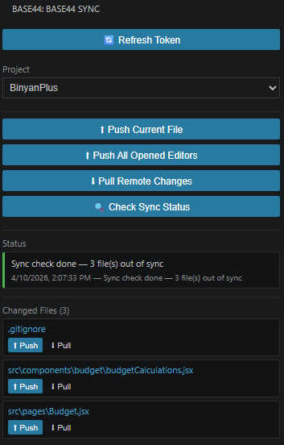

# Base44 Sync

Sync project files between your local VS Code project and a Base44 project. Pull remote changes, review diffs, and push your local files back to Base44 — all from a dedicated side panel.

> This extension is independent and not endorsed by or associated with Base44 or Wix.

## Side Panel

The Base44 icon in the Activity Bar opens the side panel, which gives you full control without ever touching the Command Palette.

## Features

### Authentication
- **Login** — opens a Chrome window to authenticate with your Base44 account. After login the app list is fetched and the selected project is saved to `base44-config.json`.
- **Refresh Token** — shown instead of Login once `base44-config.json` exists. Re-authenticates and updates the token in place.
- If `base44-config.json` is already present when VS Code starts, the extension loads it automatically — no login required.

### Project Selection
- A dropdown lists all your Base44 apps. Switching the selection updates `base44-config.json` immediately.

### Push & Pull
- **Push Current File** — deploys the active editor to Base44.
- **Push All Opened Editors** — deploys every open file, with a per-file progress bar.
- **Pull Remote Changes** — fetches all remote files, writes new/changed ones to disk, and updates the changed-files list.

### Check Sync Status
- **Check Sync Status** — fetches remote files and compares them with local files without writing anything to disk. Updates the changed-files list so you can see what's out of sync before deciding to pull.

### Status Bar
Shows the current operation with a progress bar (determinate where possible), and the timestamp + result of the last completed action.

### Changed Files List
- Lists every file that differs between local and remote.
- Click a filename to open a **Local ⟷ Remote diff** view.
- Per-file **Push** and **Pull** buttons let you sync individual files.
- The list is **persisted across VS Code restarts** via extension global state.

## Requirements

1. An active account on [Base44](https://app.base44.com/).
2. Google Chrome installed (used for the login flow).

## Quick Start

1. **Install** the extension.
2. Click the **Base44 icon** in the Activity Bar to open the side panel.
3. Click **Login** — a Chrome window opens. Sign in to Base44, then the extension saves your credentials automatically.
4. Select your project from the **Project** dropdown.
5. Click **Pull Remote Changes** to fetch your project files.
6. Edit files locally.
7. Click **Push Current File** or **Push All Opened Editors** to deploy changes back to Base44.

> **Tip:** Use **Check Sync Status** at any time to see which files are out of sync without modifying anything locally.

> **Note:** If your token expires, any push or pull will show an error status. Click **Refresh Token** to re-authenticate.

## Release Notes

### 0.0.7

- New **side panel** UI in the Activity Bar with full push/pull/sync controls.
- **Check Sync Status** button — compares remote vs local without writing files.
- **Changed files list** with per-file diff, push, and pull — persisted across restarts.
- Status box with progress bar and last-action timestamp.
- Config loaded automatically on startup — no login prompt if `base44-config.json` exists.
- Path traversal fix in remote file resolution.

### 0.0.5

- Added **`Base44: Login`** command — launches a real Chrome window to authenticate via Base44 (supports Google login).
- Login is triggered automatically when `base44-config.json` is missing or a request returns 401 Unauthorized.
- Removed the need to manually copy tokens or app IDs.

### 0.0.1

Initial release of the Base44 Sync extension.
- Deploy local files to Base44.
- Pull and diff remote files from Base44.
